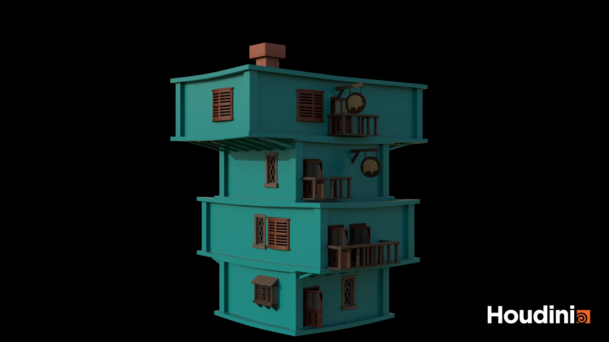

# CIS 5660 HW03 Procedural Buildings

## Project Overview
This project is a procedural building which supports:
- Box stacking
- Random assets placement
- Pillars and borders
- Supports
- Chimney

## Video
https://www.youtube.com/watch?v=Ea669dHW__I

